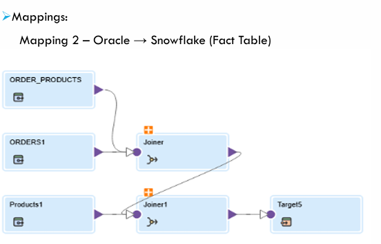

# 📦 E-Commerce Dimensional Modelling & ETL (Oracle → Snowflake)

A concise and production-ready README for the end-to-end **E-Commerce Data Warehouse** project, covering:

- Oracle (OLTP) source system
- Snowflake (OLAP) dimensional model
- Informatica IDMC ETL mappings
- Example analytical SQL queries
- Load scheduling & performance notes

---

## 🚀 Project Overview

This repository contains:

- **Oracle OLTP source table DDLs** and sample data models  
- **Snowflake star-schema DDLs** (Dimensions + Fact tables)  
- **ETL Mapping Documentation (IDMC)** to move data from Oracle → Snowflake  
- **Analytical SQL Queries** (department counts, aisle insights, top spending users, cart analysis)  
- **Scheduling guidance** for daily or incremental data loads  

---

## 🗄️ Dimensional Model (Snowflake)

### ⭐ Dimensions
- `DIM_PRODUCTS`
- `DIM_DEPARTMENTS`
- `DIM_AISLES`
- `DIM_ORDERS`

### 📊 Fact Table
- `FACT_ORDER_PRODUCTS` (contains grain: *one row per product per order*)

---

## 🔄 Informatica IDMC (ETL) Integration

### Mapping 2 – Oracle → Snowflake (Fact Table)

### Mapping 1 – Oracle → Snowflake (Dimension Tables)

---

## 🛠️ Steps for Creating Oracle → Snowflake Mappings

### 1️⃣ Source Connection (Oracle)
Configure Oracle connection:

- JDBC / Wallet / TNS
- Host, Port
- Service name  
- User authentication

### 2️⃣ Target Connection (Snowflake)
Snowflake connection requires:

- Account URL  
- User + Role  
- Warehouse  
- Database & Schema  

---

## 🔧 Mapping Logic

### **Dimension Loads**
| Oracle Source | Snowflake Target | Notes |
|--------------|------------------|-------|
| `orders`     | `dim_orders`     | Map directly; use SCD Type 2 if order attributes change |
| `products`   | `dim_products`   | Clean string fields, cast datatypes |
| `aisles`     | `dim_aisles`     | Natural key preserved |
| `departments`| `dim_departments`| No transformation required |

---

### **Fact Load**
